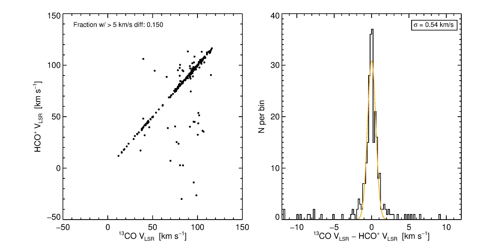
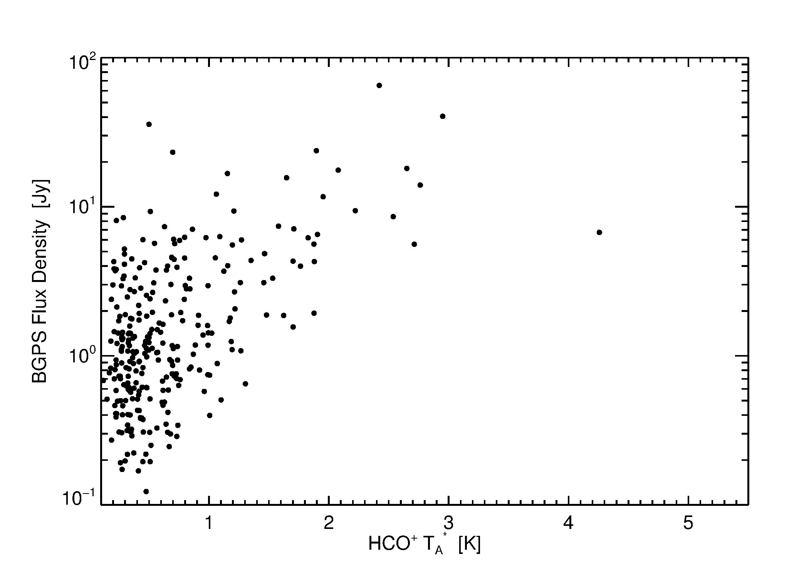
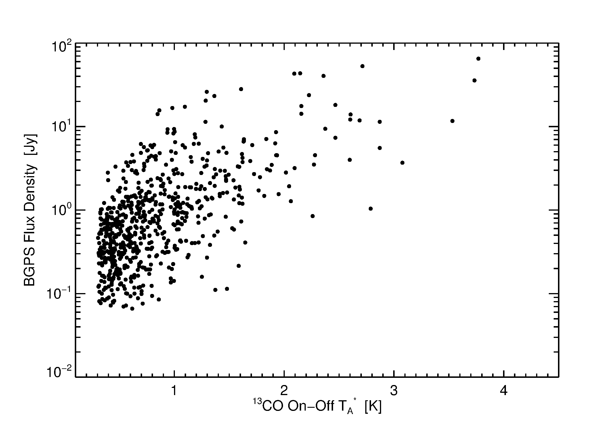
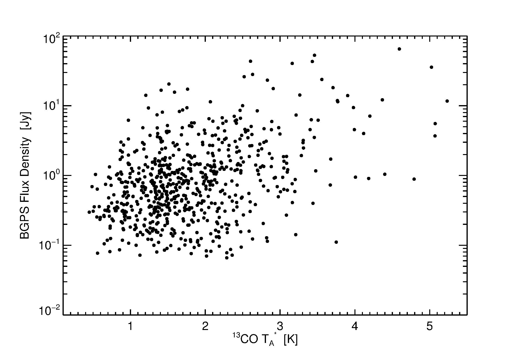
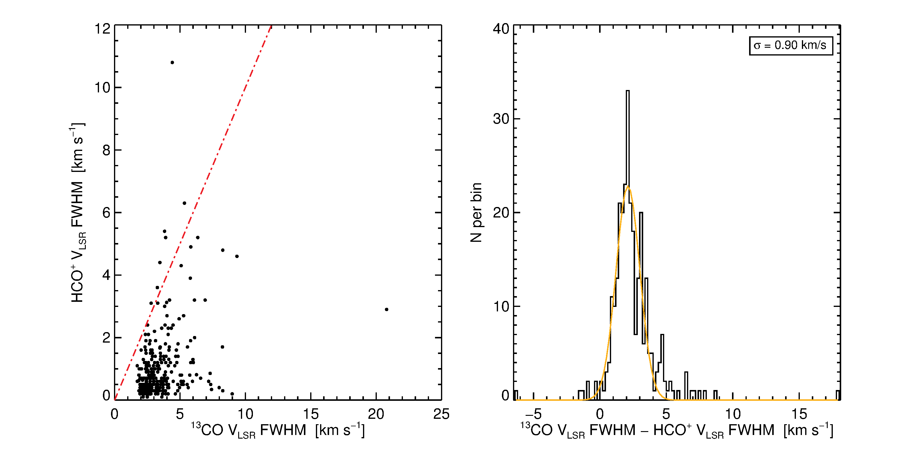

Distance Omnibus - Round 2
==========================

This repository includes primarily work performed or initialized during Erik's
August 2013 Edmonton workshop.

The goals:
 1. Increase the number of reliable distance probability distribution functions
    (DPDFs) from ~600 via the EMAF method to, ideally, ~thousands.
 2. Determine what a next possible catalog might include.

Methods Explored
----------------

GRS |13CO| core/rind on-off extraction
~~~~~~~~~~~~~~~~~~~~~~~~~~~~~~~~~~~~~~

Not all sources have HCO+ detections.  For those with HCO+ non-detections, or
v2 sources unobserved in HCO+, some other method for acquiring velocities is
useful.

Using a method described in `the Distance Omnibus conference proceedings letter`_,
we have extracted velocities for a significant number of sources.  There is python
code for the extraction component in `python/spectrum_extraction/ <python/spectrum_extraction/>`_, but Tim did
most of the work using IDL.  

.. warning:: TODO: Describe method in more detail.  A figure showing the rind & core
   regions would be very helpful here.

These plots are the most important.  First, the HCO+ and |13CO| *peak*
velocities match 85% of the time when using this method.  This is about 5%
better than Yancy did by just picking the velocity associated with the peak
|13CO| directly, but the difference between |13CO| and HCO+ velocity has a
dispersion of 0.5 km/s now, much smaller than the 2 km/s Yancy found.  
The agreement fraction is better for single-peaked |13CO| sources.

There may be hope of doing a step better, it is not yet clear.  Yancy has
suggested observing the non-matched sources deeply with the HHT to see if there
are additional HCO+ lines on the multi-peaked |13CO| lines of sight.

This LV diagram shows the HCO+ peaks in black on a GRS latitude-integrated diagram,
but with only the "rind-extracted" |13CO| spectra included.

.. image:: plots/lv_grsmatch.png
   :width: 800px

Here are some additional plots comparing |13CO| and HCO+ spectra:

.. image:: plots/hcop_thco_ta.png
   :width: 800px
.. image:: plots/hcop_thco_cdf.png
   :width: 800px

Turbulence-based Distance Methods
~~~~~~~~~~~~~~~~~~~~~~~~~~~~~~~~~

One intriguing possibility is resolving the distance, or at least the kinematic
distance ambiguity (KDA), using the known size-linewidth relation (SLR) of clouds.
We implemented two methods to measure the SLR.

The Principal Component Analysis (PCA) method
"""""""""""""""""""""""""""""""""""""""""""""

Erik worked on implementing the PCA method introduced by Mark Heyer and Chris
Brunt to measure the structure function of the molecular cloud.

He was able to successfully determine the distance to Perseus and Serpens to
within ~10-20%, which is remarkable.  Orion didn't match so well.

In order to apply this method to GRS clouds, we need to further develop a cloud
masking procedure, which may just mean clumpfinding.  Because the Galactic Plane
is full of clouds, and the PCA approach functions on PPV data cubes, it is necessary
to "mask out" the cloud of interest, otherwise the cloud signals will be confused.

The Dendrogram SLR method
"""""""""""""""""""""""""

Adam worked on using dendrograms to measure the SLR.  Dendrograms effectively
do clumpfind extractions with multiple different noise floors, preserving
information about which clumps sit inside which clouds.

Dendrogramming worked, and produced sigma-R diagrams, but there is a great deal
of uncertainty left in these, and they don't match predictions yet.

.. warning:: TODO: add figures

.. _the Distance Omnibus conference proceedings letter: http://adsabs.harvard.edu/abs/2010ASPC..438...76R 
.. |13CO| replace:: :sup:`13` CO
