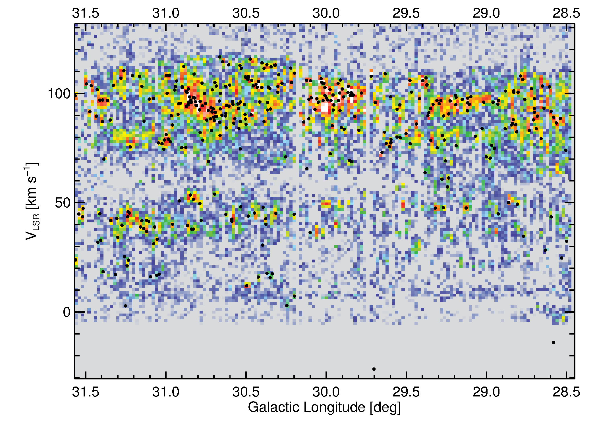
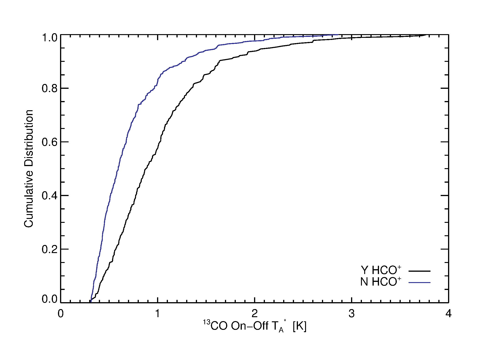
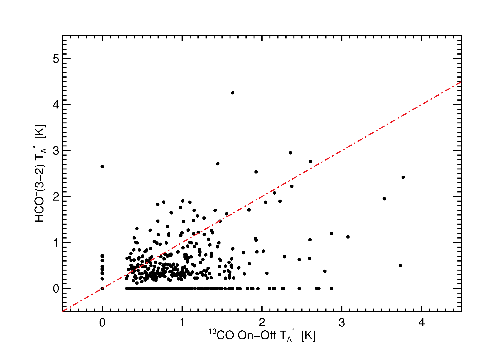

Distance Omnibus - Round 2
==========================

This repository includes primarily work performed or initialized during Erik's
August 2013 Edmonton workshop.

The goals:
 1. Increase the number of reliable distance probability distribution functions
    (DPDFs) from ~600 via the EMAF method to, ideally, ~thousands.
 2. Determine what a next possible catalog might include.

Methods Explored
----------------

GRS :sup:`13` CO core/rind on-off extraction
~~~~~~~~~~~~~~~~~~~~~~~~~~~~~~~~~~~~~~~~~~~~

Not all sources have HCO+ detections.  For those with HCO+ non-detections, or
v2 sources unobserved in HCO+, some other method for acquiring velocities is
useful.

Using a method described in `the Distance Omnibus conference proceedings letter`_,
we have extracted velocities for a significant number of sources.

.. _the Distance Omnibus conference proceedings letter: http://adsabs.harvard.edu/abs/2010ASPC..438...76R 
